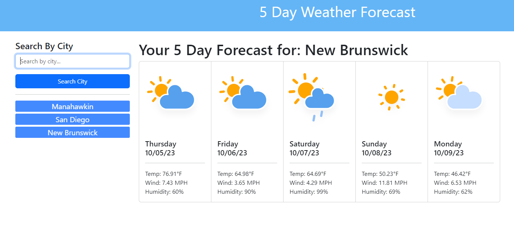

# 5-Day-Weather-Forcast

## User Story

AS A traveler  
I WANT to see the weather outlook for multiple cities  
SO THAT I can plan a trip accordingly

## Acceptance Criteria

GIVEN a weather dashboard with form inputs  
WHEN I search for a city  
THEN I am presented with current and future conditions for that city and that city is added to the search history  
WHEN I view current weather conditions for that city  
THEN I am presented with the city name, the date, an icon representation of weather conditions, the temperature, the humidity, and the the wind speed  
WHEN I view future weather conditions for that city  
THEN I am presented with a 5-day forecast that displays the date, an icon representation of weather conditions, the temperature, the wind speed, and the humidity  
WHEN I click on a city in the search history  
THEN I am again presented with current and future conditions for that city

## Site View

## Description

This app allowes the user to enter in any city in the US, converts that city to its appropriate geocoordinates and will display  
a 5 day weather forecast on the page. Search history will be saved to local storage and displayed for the user to select to view  
the current forecast of that location. Duplicate cities will not be saved and displayed to cut down on clutter and confusion.
